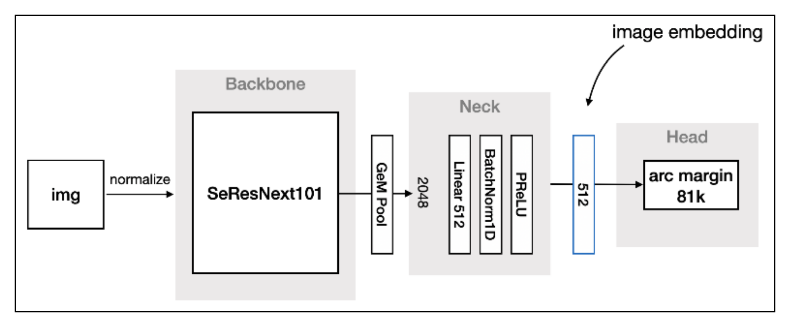

# simsiam-pytorch
This repo contains:
 * Minimal PyTorch Implementation of self-supervised SimSiam training from ["Exploring Simple Siamese Representation Learning" by Chen et al.](https://arxiv.org/abs/2011.10566)
 * Implementation of Metric Learning
<p align="center"></p>
<p align="center"></p>

### Install dependencies

```bash
pip install -r requirements.txt

```
### To train metric model
B1. Create dataset that has the following format:\
&nbsp;train/\
&nbsp;&nbsp;&nbsp;1/ \
&nbsp;&nbsp;&nbsp;&nbsp;&nbsp;&nbsp;*.png \
&nbsp;&nbsp;&nbsp;2/ \
&nbsp;&nbsp;&nbsp;&nbsp;&nbsp;&nbsp;*.png \
&nbsp;&nbsp;&nbsp;.... \
&nbsp;eval/ \
&nbsp;&nbsp;&nbsp;1/ \
&nbsp;&nbsp;&nbsp;&nbsp;&nbsp;&nbsp;*.png \
&nbsp;&nbsp;&nbsp;2/  \
&nbsp;&nbsp;&nbsp;&nbsp;&nbsp;&nbsp;*.png \
&nbsp;&nbsp;&nbsp;&nbsp;&nbsp;&nbsp;.... \
&nbsp;query/ \
&nbsp;&nbsp;&nbsp;1/ \
&nbsp;&nbsp;&nbsp;&nbsp;&nbsp;&nbsp;*.png \
&nbsp;&nbsp;&nbsp;2/ \
&nbsp;&nbsp;&nbsp;&nbsp;&nbsp;&nbsp;*.png

B2. Modify parameters in the config file train_metric_learning.json such as: data.path, model.backbone, v.v
B3. Run the following command
    ```
    python3 train_metric.py --cfg CONFIG_PATH
    ```
### To get embedding vectors of img dataset
B1. Modify parameters in the config file get_metric_embedding.json
B2. Run the following command
        ```
    python3 get_metric_mebedding.py --cfg CONFIG_PATH
    ```

### Link to pretrained Xception on synthesis dataset [link](https://drive.google.com/file/d/1m8X-7gmAkOkADuNp5PPkKmVOKpFpADlB/view?usp=sharing)

### Todo:
[x]: Implement metric learning model
[]: Optimize